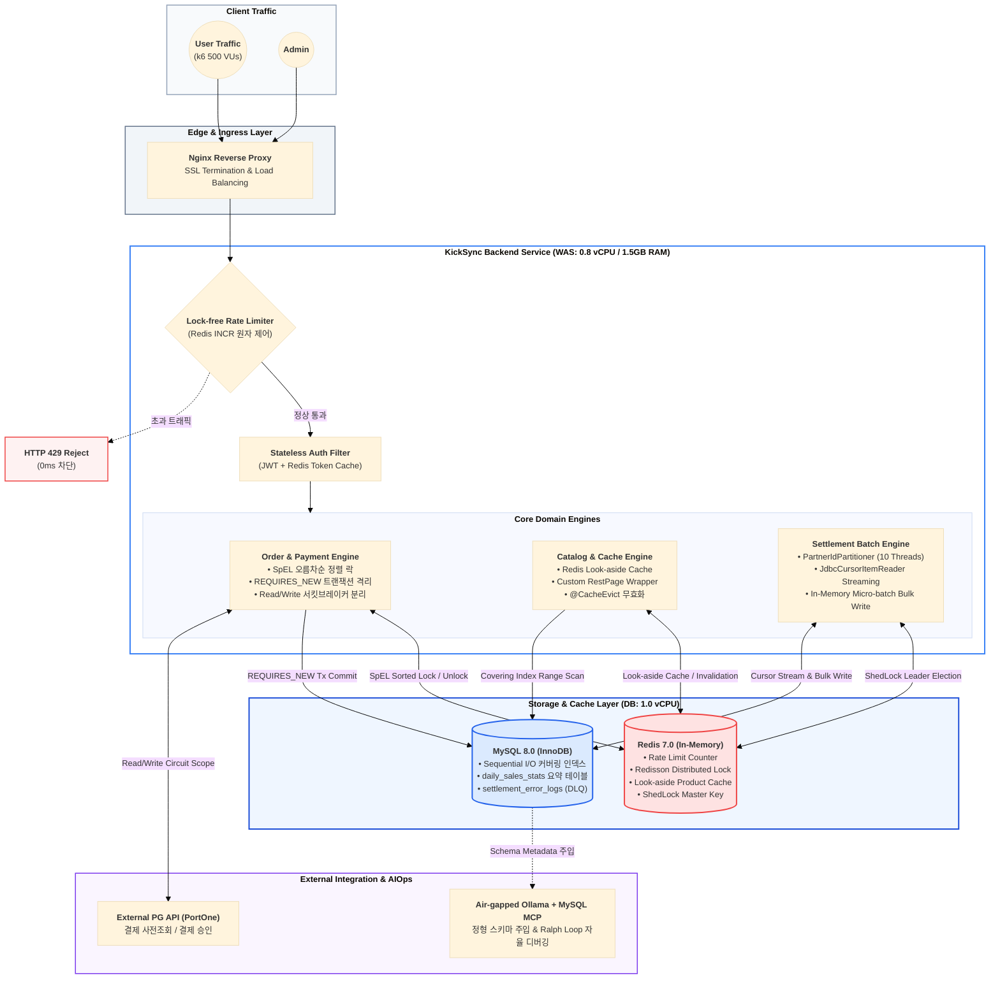
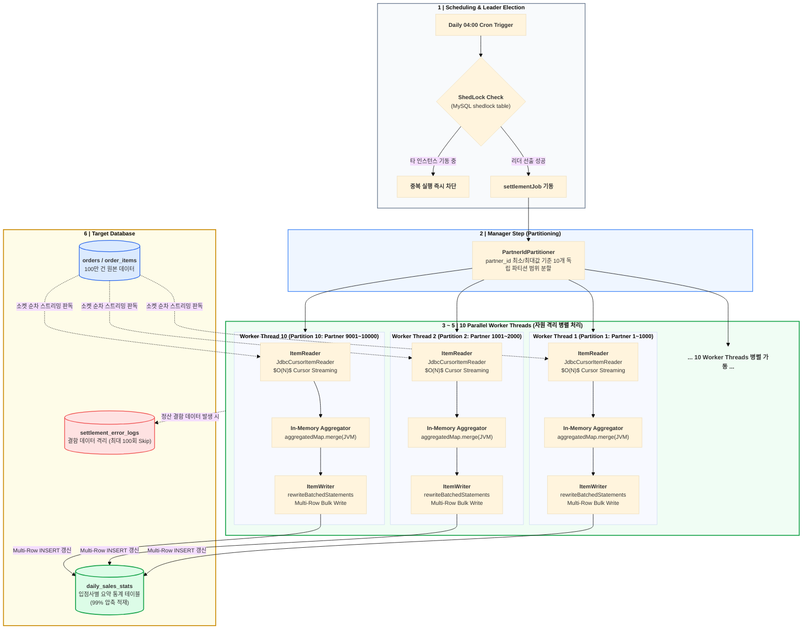
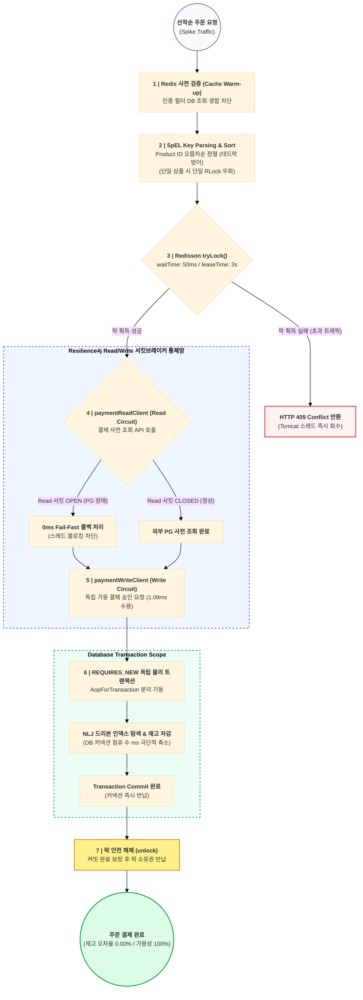
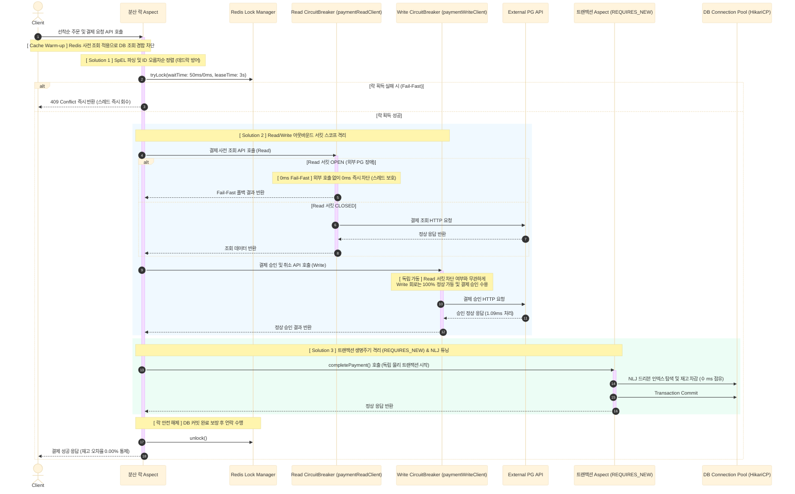
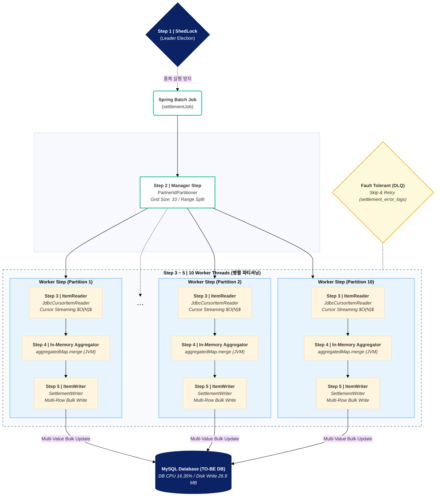
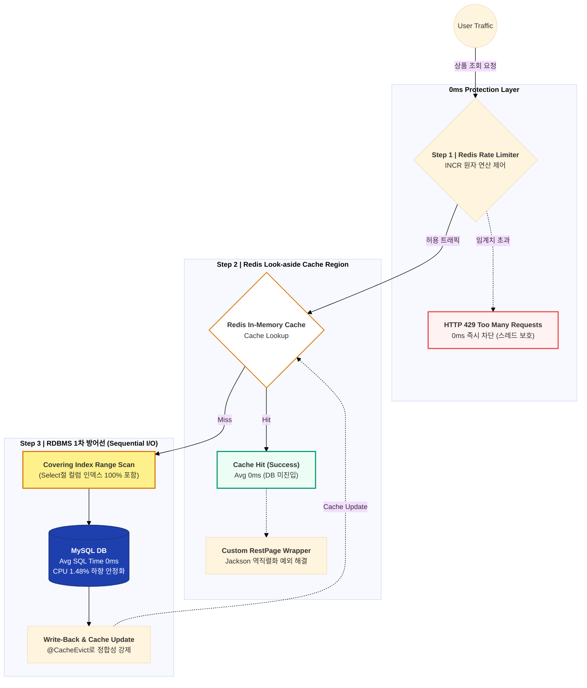
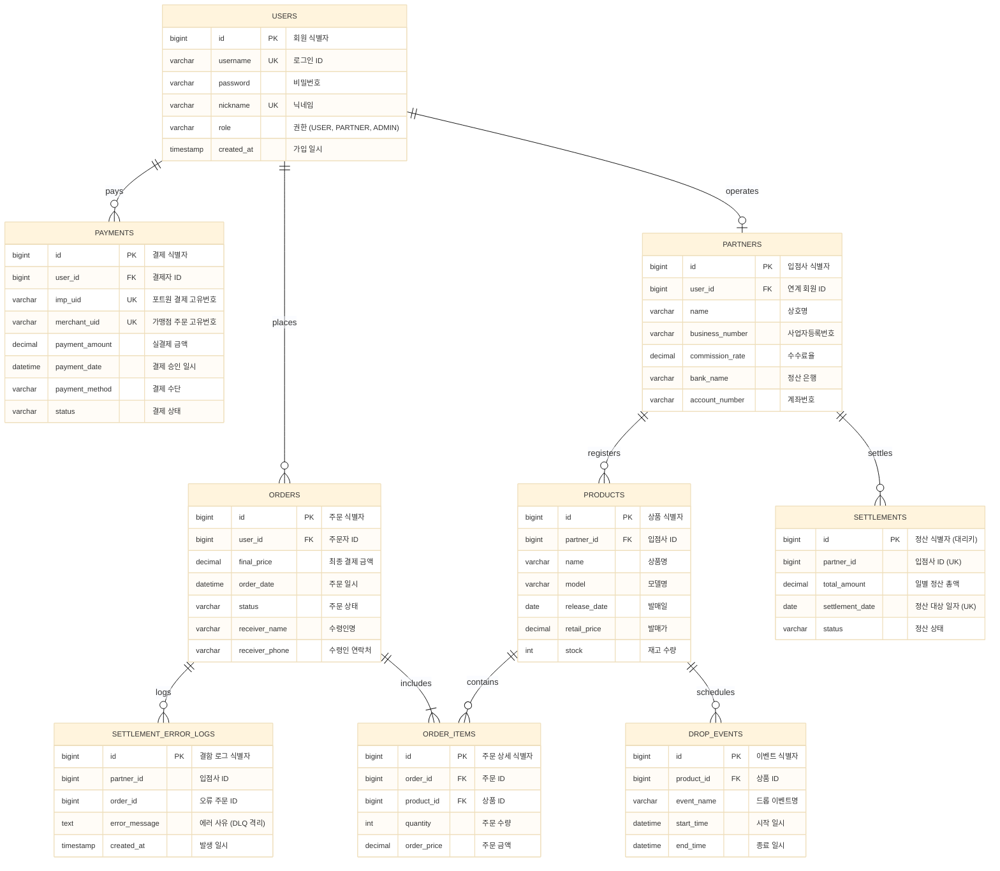

# [ KickSync ] 대용량 트래픽 및 정산 최적화 E-commerce 백엔드 플랫폼

> **핵심 가치**
> * 가혹 인프라 제약(WAS 0.8 vCPU / DB 1.0 vCPU / RAM 1.5GB) 환경을 모사하여 소프트웨어 아키텍처 튜닝만으로 시스템의 물리적 임계점 및 부하 방어 성능 계측
> * 피크 1,000 TPS 선착순 결제 부하에서 Read/Write 서킷 격리 및 정렬 락으로 가용성 100.00%를 방어하고 100만 건 정산 배치를 14분 16초에서 1분 9초로 단축한 고가용성 E-commerce 플랫폼 구축

> **핵심 성과 요약**
> * **선착순 주문 및 외부 결제 검증:** SpEL ID 정렬 락과 Resilience4j Read/Write 서킷브레이커 격리로 외부 PG 장애 시에도 평균 지연 6.96초 ➔ 83ms(중앙값 1.09ms) 단축 및 18.5만 건 수용(627.39 TPS)으로 시스템 가용성 100.00% 사수
> * **대용량 배치 정산 최적화:** `PartnerIdPartitioner` 10개 범위 파티셔닝과 커서 스트리밍 및 JVM In-Memory Micro-batch 사전 집계와 `rewriteBatchedStatements` 벌크 연산으로 100만 건 정산 시간 14분 16초 ➔ 1분 9초 단축, 물리 Disk Write 1.8GB ➔ 26.9MB(98.5% 절감) 및 DB CPU 87.43% ➔ 16.35% 안정화
> * **신규 발매 상품 조회 최적화:** `EXPLAIN ANALYZE` 기반 커버링 인덱스(Sequential I/O)와 Redis Look-aside 캐싱 및 Lock-free `INCR` Rate Limiter 2중 통제망으로 DB CPU 점유율 44.95% ➔ 1.48% 통제(96.7% 부하 평탄화), SQL Time 0ms 기록 및 인프라 가용성 86.33% 확보
> * **사내 DB 보안 AIOps 파이프라인:** Air-gapped 로컬 런타임(`Ollama`)과 `MySQL MCP Server`(Stdio JSON-RPC) 및 `Ralph Loop` 자율 디버깅과 Human Gate 승인망 결합으로 LLM 스키마 환각률 0% 통제 및 개발 생산성 30% 향상

<br>

<div align="left">
  <h3>API 테스트 & 문서 (Swagger UI)</h3>
  
  <a href="http://134.185.116.180/swagger-ui/index.html#/">
  
</a>
</div>

> Swagger UI를 통해 API를 직접 호출해 보실 수 있습니다. 로그인 후 발급된 Access Token을 Authorize 버튼에 입력하여 테스트 가능합니다.

<br><br>

## 1. 프로젝트 소개

**[ KickSync ]** 는 대규모 트래픽과 데이터가 발생하는 이커머스 환경(KREAM, StockX 등)에서의 **안정성과 성능 최적화**에 주력한 엔지니어링 백엔드 프로젝트입니다.

플랫폼 성장에 따라 급증하는 트래픽과 정산 데이터를 효율적으로 처리하기 위해 **시스템 확장성 확보와 데이터 정합성 보장**을 최우선 엔지니어링 목표로 설정했습니다.

### 주요 도메인 기능

* **Commerce (주문 및 동시성 제어):**
    * **SpEL 정렬 분산 락:** 선착순 구매 시 발생하는 다중 락 교착 상태(Deadlock)를 방어하기 위해 SpEL 기반 Product ID 오름차순 정렬 Redisson MultiLock 도입
    * **트랜잭션 생명주기 격리:** `@Transactional` 커밋 전 락 선제 해제로 인한 초과 판매(Overselling)를 막기 위해 `REQUIRES_NEW` 독립 물리 트랜잭션 분리 AOP 구축
    * **Read/Write 서킷브레이커 스코프 격리:** 외부 PG 조회 장애 시 Read 회로만 0ms Fail-Fast로 차단하고 실제 결제 승인 및 취소(Write) 회로는 1.09ms로 100% 독립 수용하여 연쇄 장애 차단

* **Settlement (입점사 100만 건 대용량 정산):**
    * **범위 파티셔닝 (`PartnerIdPartitioner`):** 입점사 식별자 ID 범위를 10개 파티션으로 분할하여 10개 비동기 스레드 풀에 읽기 및 쓰기를 분배하여 InnoDB 갭 락 충돌 가능성 배제
    * **선형 커서 스트리밍 (`JdbcCursorItemReader`):** `LIMIT/OFFSET` 페이징의 $O(N^2)$ 누적 스캔 오버헤드를 해소하고 커넥션 소켓 기반 $O(N)$ 선형 순차 스트리밍 수신
    * **In-Memory Micro-batch & Bulk Write:** JVM 힙 메모리 레벨 1차 사전 집계(`aggregatedMap.merge()`) 및 `rewriteBatchedStatements=true` Multi-Row Bulk Write 결합으로 물리 디스크 I/O 98.5% 절감
    * **Fault Tolerant & DLQ:** 결함 데이터 식별 시 전체 배치 롤백을 막기 위해 최대 100회 Skip 허용 및 에러 전용 DLQ(`settlement_error_logs`) 격리

* **Catalog & Shield (상품 조회 및 트래픽 방어):**
    * **`EXPLAIN ANALYZE` 커버링 인덱싱:** B+Tree 세컨더리 2단 점프(Random Read I/O)를 순차 탐색(Sequential I/O) 구조로 1차 감축
    * **Look-aside 캐싱 & Custom `RestPage` Wrapper:** 조회가 집중되는 핫데이터를 Redis 캐싱으로 우회하여 RDBMS Avg SQL Time을 0ms로 평탄화하고 Jackson 역직렬화 예외 해결
    * **Lock-free Rate Limiter:** 서비스 진입점에 Redis `INCR` 원자 연산 기반 Rate Limiter를 배치하여 악성 트래픽을 HTTP 429로 0ms 만에 즉시 차단

* **AIOps & Observability (사내 보안 지능화):**
    * **Air-gapped 로컬 런타임 (`Ollama`):** 사내 DB 스키마 외부 유출을 차단하는 100% 사내 폐쇄망 로컬 LLM 구동
    * **Custom MySQL MCP Server:** Anthropic Model Context Protocol(JSON-RPC over Stdio) 표준으로 DB 정형 스키마 메타데이터를 직접 주입하여 환각률 0% 통제
    * **Ralph Loop & Human Gate:** 오류 발생 시 3회 자가 치유 피드백 루프 및 최종 DML 물리 반영 전 엔지니어 1-Click 승인망 결합

### 디렉토리 구조 (Feature-driven Architecture)

```text
src/main/java/be/kicksync_backend
├── common                      # 전역 공통 인프라 및 횡단 관심사
│   ├── annotation              # @DistributedLock, @RateLimit 커스텀 어노테이션
│   ├── aop                     # SpEL 정렬 분산 락 및 Lock-free RateLimit AOP
│   ├── config                  # Redis, Redisson, Resilience4j, ShedLock, Swagger 설정
│   ├── dto                     # ApiResponse, RestPage 래퍼 등 공통 응답 규격
│   ├── exception               # GlobalExceptionHandler 및 표준 에러 규격
│   ├── security                # JWT 필터 및 Stateless 인증/인가
│   └── util                    # REQUIRES_NEW 트랜잭션 분리 도우미(AopForTransaction)
└── feature                     # 도메인 주도 패키지 (비즈니스 로직 응집)
    ├── order                   # 선착순 주문, Order Splitting 및 다중 결제 비즈니스 로직
    ├── payment                 # 외부 PG 연동 및 Read/Write 서킷브레이커 격리 클라이언트
    ├── settlement              # 대용량 정산 파티셔닝(PartnerIdPartitioner), 커서 스트리밍, 벌크 적재
    ├── product                 # 커버링 인덱싱, Redis Look-aside 캐싱 및 상품 조회
    ├── partner                 # 입점사 관리 및 수수료 정책
    └── user                    # 회원 도메인 및 인증 처리
```

<br><br>

## 2. 아키텍처 및 핵심 프로세스

### 2-1. 전체 시스템 아키텍처 (System Architecture)



<br>

### 2-2. 대용량 정산 병렬 파티셔닝 프로세스 (Batch Process Architecture)



<br>

### 2-3. 핵심 서비스 흐름: 선착순 주문 및 결제 가용성 파이프라인



<br><br>

## 3. 기술 스택

| Category | Technology | Reason for Selection |
| --- | --- | --- |
| **Language** |  | Virtual Threads 및 ZGC 환경 하에서 고부하 I/O 블로킹 최소화 및 안정적인 힙 메모리 통제 |
| **Framework** |   | Chunk 지향 처리, 범위 파티셔닝 기반 대용량 병렬 데이터 분산 및 Job Repository 실패 이력 관리 |
| **Database** |   | InnoDB ACID 트랜잭션 무결성 보장, Redisson 분산 락 및 Look-aside 인메모리 고속 캐싱 |
| **Resilience & AI** |    | Read/Write 아웃바운드 서킷브레이커 스코프 격리 및 사내 폐쇄망 MCP 스키마 자동 주입 파이프라인 |
| **ORM & Driver** |   | 도메인 모델링 생산성 확보 및 `rewriteBatchedStatements=true` Multi-Row Bulk Write 결합 |
| **Infra & CI/CD** |    | Docker 자원 제약 모사를 통한 아키텍처 임계점 계측 및 OCI 기반 무중단 배포 파이프라인 자동화 |
| **Test & Monitor** |    | 피크 1,000 TPS ramping 부하 인가 및 Scouter APM, `docker stats`, JDK 21 `jcmd` 스레드 덤프 삼각 계측 |

<br><br>

## 4. 핵심 엔지니어링 최적화 딥다이브

> **"하드웨어 증설 없는 소프트웨어 아키텍처 튜닝의 실측"**: WAS 0.8 vCPU / DB 1.0 vCPU / RAM 1.5GB의 가혹한 격리 환경에서 소프트웨어 아키텍처 튜닝만으로 물리적 병목을 해결한 3대 핵심 과정입니다.

---

### [ Deep-Dive 1 ] 선착순 주문 및 외부 결제 동시성 최적화: 가용성 0% ➔ 100.00% 복구

**Q. 다중 상품 결제 시의 데드락과 500ms 외부 PG 장애 상황에서 어떻게 시스템 가용성을 사수할 것인가?**

* **문제 상황 (AS-IS):**
  * 500 VUs 피크 부하 인가 시 SpEL 다중 락 키 정렬 누락으로 스레드 간 교착 상태(Deadlock)가 발생하여 톰캣 스레드 200개가 `TIMED_WAITING`으로 정체
  * 트랜잭션 커밋 전 락이 조기 해제되어 타 스레드가 과거 재고를 읽는 갱신 손실(초과 판매) 발생
  * 500ms 네트워크 지연을 수반하는 외부 결제 API가 DB 트랜잭션 내에 강결합되어 10개뿐인 `HikariCP` 커넥션 풀이 전면 고갈되어 무관한 인증 필터(JWT) 조회까지 타임아웃되는 연쇄 장애(가용성 0.00%) 유발



* **해결 전략 및 아키텍처:**
  1. **SpEL ID 정렬 락 (`DistributedLockAop`):** SpEL로 추출한 상품 ID들을 오름차순 정렬하여 락을 단방향으로 획득하게 강제해 데드락 발생 가능성 배제 (단일 상품 주문 시 `RLock` 우회 분기 설계로 Redis CPU 4.16% ➔ 2.15% 최적화)
  2. **트랜잭션 생명주기 분리 (`REQUIRES_NEW`):** 비즈니스 메소드를 독립 트랜잭션으로 가동하고 물리적 DB 커밋 완료 후에만 `unlock()`을 실행하여 초과 판매 오류 해결
  3. **외부 API 트랜잭션 외부 분리:** 500ms 네트워크 연동 동안 DB 커넥션을 점유하지 않도록 트랜잭션 외부로 격리하여 커넥션 점유 시간을 수 ms 초단기로 축소
  4. **Resilience4j Read/Write 서킷브레이커 스코프 격리:** `paymentReadClient`와 `paymentWriteClient` 회로를 독립 분리하여 외부 PG 조회 장애 시 Read만 0ms Fail-Fast로 차단하고 결제 승인(Write)은 1.09ms로 100% 독립 수용

* **정량적 실측 성과 (5분간 500 VUs 피크 스트레스 계측):**
  * **평균 응답 지연:** 6,960ms ➔ **83.03ms (중앙값 1.09ms, P95 513ms, 98.8% 단축)**
  * **총 처리량:** 19,307건 ➔ **185,692건 완주 (평균 627.39 TPS, 9.6배 향상)**
  * **자원 부하 점유율:** WAS CPU 48.13%, DB CPU 0.56% (84.1% 부하 평탄화)
  * **데이터 정합성 및 가용성:** **초과 판매 0건 (오차율 0.00%)**, **시스템 가용성 100.00% (Error Rate 0.00%)**

---

### [ Deep-Dive 2 ] 입점사별 100만 건 대용량 정산 최적화: 처리 시간 14분 16초 ➔ 1분 9초 단축

**Q. 100만 건의 대용량 결제 데이터를 한정된 DB 자원 하에서 메모리 누수와 디스크 I/O 폭격 없이 정산할 수 있는가?**

* **문제 상황 (AS-IS):**
  * `JpaPagingItemReader`의 `LIMIT/OFFSET` 페이징으로 인해 후반부 접근 시 90만 건의 데이터를 읽고 버리는 $O(N^2)$ 누적 스캔 부하 발생 (SQL Time 774초 소요)
  * 청크 루프 내 `jdbcTemplate.update()` 건건이 동기 실행으로 100만 번의 `fsync()` 시스템 콜이 물리 디스크에 전달되어 **1.8 GB에 달하는 Disk Write 폭격** 유발
  * `settlements` 복합 유니크 제약조건 하에서 멀티스레드 동시 쓰기 시 공유 갭 락(Shared Gap Lock) 충돌 및 배타 락 승격 대기 데드락으로 `HikariCP Connection Leak` 경보 발생 및 DB CPU 87.43% 포화



* **해결 전략 및 아키텍처:**
  1. **범위 기반 파티셔너 (`PartnerIdPartitioner`):** `partner_id` 최소/최대 범위를 기준으로 10개 파티션을 물리 격리 생성하여 10개 병렬 비동기 스레드에 분배하여 갭 락 경합 및 데드락 가능성 배제
  2. **선형 Cursor Streaming (`JdbcCursorItemReader`):** DB 커넥션 소켓을 유지한 채 `ResultSet.next()`로 1건씩 순차 스트리밍 수신하여 $O(N)$ 선형 스캔 보장
  3. **JVM In-Memory Micro-batch 사전 집계:** 청크 데이터를 DB에 건건이 쓰지 않고 JVM 힙 메모리에서 `aggregatedMap.merge()`로 1차 누적합 집계하여 DML 요청 수를 99% 삭감
  4. **JDBC 드라이버 벌크 쿼리 옵션 (`rewriteBatchedStatements=true`):** 다중 쿼리를 Multi-Row INSERT로 재작성 송신하여 물리 디스크 쓰기량을 1.8GB에서 26.9MB 수준(98.5% 절감)으로 대폭 축소
  5. **Fault Tolerant & DLQ 가드레일:** 정산 결함 데이터 식별 시 전체 롤백 대신 최대 100회 Skip 허용 및 에러 전용 DLQ(`settlement_error_logs`) 테이블에 자동 격리

* **정량적 실측 성과 (100만 건 정산 벤치마크 계측):**
  * **총 소요 시간:** 14분 16.29초 (856,294ms) ➔ **1분 9.49초 (69,493ms, 12.3배 단축)**
  * **DB CPU 점유율:** 최대 87.43% ➔ **평균 16.35% (71.08%p 안정화)**
  * **WAS CPU 가동률:** 평균 16% ➔ **평균 80.02% (유휴 대기 자원을 연산 속도로 치환)**
  * **물리 Disk Write I/O:** 1.8 GB ➔ **26.9 MB (98.5% 제거)**
  * **Scouter SQL Time:** 774,656ms (100만 회) ➔ **104ms (33회, 99.9% 삭감)**
  * **정합성 및 가동률:** **정산 금액 150억 원 정합성 100% 일치**, **배치 가동률 100.00% 완수**

---

### [ Deep-Dive 3 ] 신규 발매 상품 조회 최적화: DB CPU 44.95% ➔ 1.48% 평탄화

**Q. 500만 건 대규모 상품 테이블에서 인기 상품 발매 직후 조회 트래픽 폭증 시 RDBMS 물리 한계를 어떻게 극복할 것인가?**

* **문제 상황 (AS-IS):**
  * 인기 상품 발매 직후 500만 건 테이블 스캔 시 B+Tree 세컨더리 인덱스 스캔 후 PK 클러스터드 인덱스로 재탐색하는 **2단 점프(Random Read I/O)**로 단일 SQL 평균 32ms 지연 유발
  * 10개 제한의 `HikariCP` 커넥션 풀을 반납하지 못해 톰캣 스레드 134개가 대기 상태로 정체되며 응답 지연이 최장 9.0초까지 연장
  * 지연된 요청 객체들이 힙 메모리에 쌓여 기동 40초 만에 1,000MB에 도달했고 객체 생성 속도가 GC 회수 속도를 초과하여 **최대 12초 ZGC STW 스파이크** 및 가용성 82.88% 붕괴



* **해결 전략 및 아키텍처:**
  1. **`EXPLAIN ANALYZE` 기반 커버링 인덱싱:** Select절 컬럼을 복합 인덱스에 100% 포함시켜 PK 클러스터드 인덱스 재탐색(Random Read)을 없애고 순차 탐색(Sequential I/O)으로 쿼리 비용 1차 감축
  2. **Look-aside 캐싱 & Custom `RestPage` Wrapper:** 메인 조회를 Redis 캐시로 우회하고 Spring Data JPA `PageImpl`의 직렬화 오류를 해결하는 `RestPage` 커스텀 래퍼 설계
  3. **Lock-free Rate Limiter:** 서비스 진입점에 Redis `INCR` 원자 연산 기반 Rate Limiter를 배치하여 악성 트래픽을 HTTP 429로 0ms 만에 즉시 차단
  4. **Java 21 `jcmd` 인라인 도구 계측:** Java 21 환경에서 APM의 Attach API 호환 한계(`ClassNotFoundException: HotSpotVirtualMachine`)를 진단하고 WAS 컨테이너 내 `jcmd` 및 `jstack`을 직접 호출하는 우회 경로로 락 메트릭을 누수 없이 수집

* **정량적 실측 성과 (500 VUs 피크 1,000 TPS 부하 계측):**
  * **DB CPU 점유율:** 44.95% ➔ **Avg 1.48% (최대 24.11%, 96.7% 부하 평탄화)**
  * **RDBMS Avg SQL Time:** 32ms ➔ **0ms (Flatline, DB 쿼리 부하 소거)**
  * **총 처리량:** 50,484건 ➔ **58,902건 완주 (16.7% 향상)**
  * **Scouter XLog 응답 대역:** 최장 9.0s ➔ **0.50초 이하 짙은 띠(Band) 형성 (94.4% 실질 단축)**
  * **스레드 락 메트릭:** HikariCP 대기 스레드 134개 ➔ **0개**, 동기화 락 경합(`BLOCKED`) 69개 ➔ **0개 (완전 해소)**
  * **인프라 가용성:** 82.88% ➔ **86.33% 확보 (HTTP 429 0ms 방어)**

<br><br>

## 5. 트러블 슈팅 및 설계 회고

### 1. SpEL 파싱 기반 정렬 락 단일/다중 분기 튜닝
다중 상품 주문 시 데드락을 막기 위해 Redisson `MultiLock`을 적용했으나 단일 상품 주문 건까지 무조건 `MultiLock`을 호출할 경우 Redis CPU 오버헤드가 증가하는 현상을 발견했습니다. 이를 해결하기 위해 AOP 내부에서 키 개수가 1개일 경우 단일 `RLock`으로 우회하는 분기 로직을 설계하여 Redis CPU 점유율을 **4.16%에서 2.15%로 48.3% 추가 절감**했습니다.

### 2. 분산 환경 스케줄러 중복 실행 방지 (ShedLock)
다중 인스턴스(Scale-out) 환경에서 동일 정산 배치가 중복 실행되는 레이스 컨디션을 방어하기 위해 별도의 무거운 인프라(Airflow 등)를 도입하는 대신 RDBMS 메타데이터 기반의 **ShedLock**을 채택했습니다. 이를 통해 추가 인프라 비용 없이 다중 인스턴스 환경에서 단일 리더 실행 무결성을 확보했습니다.

### 3. Java 21+ Scouter APM Attach API 호환 한계 극복
Java 21 가상 스레드 환경에서 Scouter APM이 스레드 덤프를 추출할 때 JDK 9+ 모듈화(`sun.tools.attach`) 제약으로 예외가 발생하는 한계를 식별했습니다. 이에 APM 자동화 도구에만 의존하지 않고 WAS 컨테이너 내부 런타임에 직접 접속하여 JDK 21 표준 진단 도구인 **`jcmd` 및 `jstack`을 직접 호출하는 독립 수집 경로**를 구축함으로써 고부하 환경에서도 스레드 락 메트릭을 누수 없이 정밀 분석했습니다.

<br><br>

## 6. ERD (데이터베이스 모델링)



* **[ ERD Cloud 인터랙티브 다이어그램 바로가기 ](https://www.erdcloud.com/d/B5xBxsPqkP4uwSPt4)**

<br><br>

## 7. 인프라 운영 및 CI/CD 파이프라인

* **컨테이너 가상화:** Docker Compose를 활용해 WAS, MySQL, Redis, Nginx, Scouter APM을 격리 배포하고 물리 자원(CPU, RAM, HikariCP)을 엄격히 제한하여 프로덕션 부하 임계점 모사
* **배포 자동화:** GitHub Actions를 연동하여 `main` 브랜치 푸시 시 Gradle 빌드, Docker Image 빌드 및 Oracle Cloud Infrastructure(OCI) 인스턴스로의 자동 롤링 배포 파이프라인 완비
